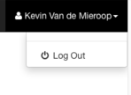

## README

STAGEREPOhelper is een applicatie ontwikkeld om in 1 oogopslag enkele statistieken te bekijken van de repositories waar studenten tijdens hun stage alle documenten en code opslaan. De webapp zelf wordt op Heroku gehost en is  [hier](stagerepohelper.herokuapp.com) te vinden.

Een GitHub-account is nodig om te applicatie te gebruiken! Authenticatie gebeurt via OAuth. Een token wordt gebruikt om de GitHub API te behandelen.

### Lokaal installeren
De source code van de applicatie is vrij voor iedereen en mag gewijzigd worden.  
Wil je ze lokaal opstarten?
Clone dan de repo en installeer alle nodige dependencies:

    npm install

Open de applicatie met de Node.js runtime of maak gebruik van nodemon:

    node server.js

    nodemon server.js

#### Dependencies
Hieronder een lijst van alle nodige npm modules om gebruik te maken van de applicatie:

  * <b>Body-parser</b> - haalt de gehele body uit een request en steekt ze in een formaat dat gemakkelijker is om mee te werken (b.v. JSON)
  * <b>Express</b> - Zorgt voor de routing binnen een web applicatie
  * <b>Express-partials</b> - Express middleware voor template engines
  * <b>Express-session</b> - Session middleware voor express (ipv cookies/cookie-parser)
  * <b>GitHub-API</b> - high-level npm module die de github api kan behandelen
  * <b>Jade</b> - template engines
  * <b>Method-override</b> - geeft extra REST support waar client het normaal niet toelaat; nodig voor GitHub OAuth
  * <b>Passport</b> - authenticatie middleware
  * <b>Passport-github2</b> - extensie voor passport om gebruik te maken van GitHub OAuth

#### Extra
Extra assets die gebruikt worden:

  * SB Admin Bootstrap template

### Gebruik
Wanneer men naar de applicatie gaat, wordt er meteen nagekeken of er een sessie actief is. Zoja, wordt het dashboard geladen (/dash). Indien niet, wordt er naar het login-scherm gegaan:

Hier is 1 knop: de "Login via GitHub"-knop. Als hierop wordt geklikt wordt men naar GitHub verwezen. Daar moet STAGEREPOhelper toestemming krijgen om jouw gegevens op te halen. Wanneer dit gebeurd is wordt er via een callback terug naar de applicatie gegaan. Hier wordt opnieuw de sessie nagekeken, waarna het dashboard geladen wordt:

Op het dashboard worden alle repositories opgehaald van de AP-Elektronica-ICT organisatie opgehaald. Een ng-repeat toont ze een voor een in een lijst. In elke iteratie staat de titel van de repository, het icoontje van de eigenaar (mouseover toont de naam van de eigenaar) en de omschrijving van de repo. In 2 panels wordt enerzijds de dagen sinds de laatste commit weergegeven en anderzijds het aantal open issues. Het aantal dagen sinds de laatste commit zal een groene achtergrond hebben als het minder dan 200 dagen geleden is, geel indien het tussen de 200 en 500 dagen ligt en rood als het meer dan 500 dagen geleden is (dit is enkel voor testing purposes, met de uiteindelijke stagerepos zullen deze grenzen veel lager liggen). Het aantal open issues zal enkel groen zijn als het 0 is, als er uberhaupt open issues zijn zal het rood zijn.
Elks van deze 2 divs heeft nog een mouse-over event (angularjs: mouseenter): wanneer men over de commit-div gaat wordt er rechts het totaal aantal commits weergegeven en de omschrijving plus auteur (met avatar) van de laatste commit. Hier een voorbeeld:

Wanneer men op de div klikt gaat men naar de eerstvolgende commit tot alle commits zijn weergegeven. 

Gelijkaardig worden alle issues weergegeven als men met de muis over de issue-div gaat. Hier komt de laatste open issue rechts te staan, met enerzijds de beschrijving en anderzijds de auteur (en avatar) van de opener. Opnieuw wordt er naar de eerstvolgende issue gegaan als men op de div klikt. Hieronder een voorbeeld:

 

Ten laatste wordt er, indien aanwezig, een link naar het log-bestand gemaakt. Deze link wordt weergegeven in de vorm van een document-icoontje:

Rechts bovenaan wordt de volledige naam van de ingelogde gebruiker weergegeven. Dit wordt opgehaald door het req.user object (displayName) op de server (afkomstig van GitHub).
Wanneer men hierop klikt komt er een dropdown menu met daarin een Logout-knop. Hierdoor wordt de sessies beeindigd en belandt men opnieuw op de inlog-pagina:

##### Bonus
Hieronder een screenshot van een mobile scherm:

#### Auteur
Kevin Van de Mieroop  
AP University College
